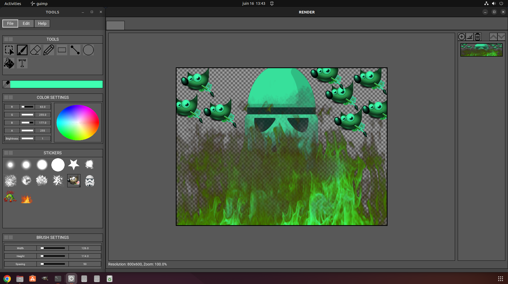

# GUImp

A project from **42 School** consisting of creating a custom graphical user interface library using **SDL2**, and then using this library to build a lightweight version of GIMP.

This project aims to recreate a simplified image editor with custom UI rendering and basic image manipulation features.

---

## Dependencies

```bash
sudo apt install libsdl2-dev libsdl2-image-dev libsdl2-ttf-dev
```

---

## Launching

```bash
make && ./guimp
```

## Screenshot

[](https://www.youtube.com/watch?v=oCEkPwQBrj0)

---

https://youtu.be/oCEkPwQBrj0

# Backend: libui

The first part of the project consists of creating a custom **libui** library, similar to **libft**, providing a complete graphical user interface framework.

The library must be able to:

* Create graphical windows with customizable parameters:

  * Size
  * Resizability
  * Background color or image
  * Visual effects
  * Themes and styles

* Provide different types of windows:

  * Generic windows
  * Modal **OK** dialogs
  * Modal **OK / Cancel** dialogs

* Support a variety of UI elements:

  * Buttons
  * Menus
  * Text labels
  * Images
  * Editable text fields
  * Text areas
  * Checkboxes
  * Radio buttons
  * Sliders
  * Drop-down lists
  * Progress bars

* Allow each element to be customized through:

  * Styles
  * Themes
  * Colors
  * Fonts
  * Functional behaviors

* Support nested elements:

  * Menus inside menus
  * Images inside buttons
  * Other hierarchical UI compositions

* Manage user interactions:

  * Mouse clicks
  * Focus events
  * Keyboard events
  * Custom callbacks
  * Default element behaviors

* Demonstrate the coexistence of built-in and user-defined actions.

* Allow interactions between elements:

  * Example: enabling a button displays additional options.

* Provide a default hotkey system for each element type.

* Support scrolling:

  * Scrollable windows
  * Scrollable UI elements when applicable

* Include reusable prefabs for common interfaces:

  * Information bars
  * Standard menus (Open, Save, Quit, etc.)

* Provide at least:

  * A file selection dialog prefab
  * A font selection dialog prefab

* Support drag-and-drop on:

  * UI elements
  * Windows

All implemented features that are not directly used in GUImp must still be demonstrated during the project defense.

---

# Frontend: GUImp

The graphical editor must satisfy the following requirements:

## General Behavior

* Pressing **ESC** must properly close all windows and terminate the program.
* Clicking the window close button must close the corresponding window.
* If the rendering window is closed, the entire program must exit properly.
* Image rendering must take place within a single rendering window.

## Tool Palette

A dedicated tool window must contain at least:

* Brush tool

* Eraser tool

* Line drawing tool

* Shape drawing menu supporting:

  * Lines
  * Rectangles
  * Squares
  * Circles
  * Filled and outlined variants

* Zoom and hand tools

* Line thickness selection

* Image import menu

* Color selection tools:

  * RGB wheel
  * RGB sliders
  * Equivalent color picker interface

* Workspace clear button

* Brush/sticker menu allowing the user to place predefined images smoothly onto the canvas

* Fill tool (paint bucket)

* Text insertion tool with:

  * Color selection
  * Font selection
  * Font size selection

* Eyedropper tool for picking colors directly from the image

## Additional Features

* The mouse cursor must change depending on the selected tool.
* Images must be savable in a format of your choice.
* Image import must support:

  * JPEG
  * PNG

  with particular emphasis on JPEG support.

---

# Important Constraint

All graphical operations must exclusively use the **libui** library.

The GUImp application must **never directly use SDL, the operating system graphical framework, or any other graphics management library**.

All rendering, event handling, and interface management must go through **libui only**.
